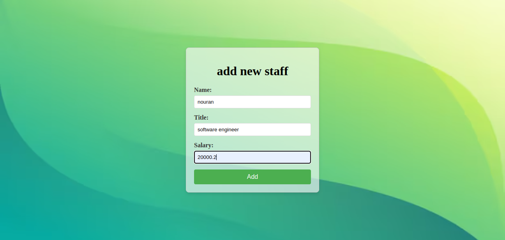
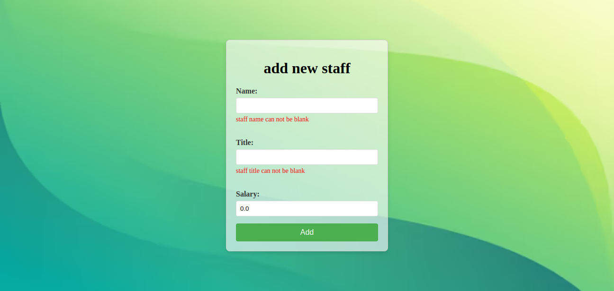
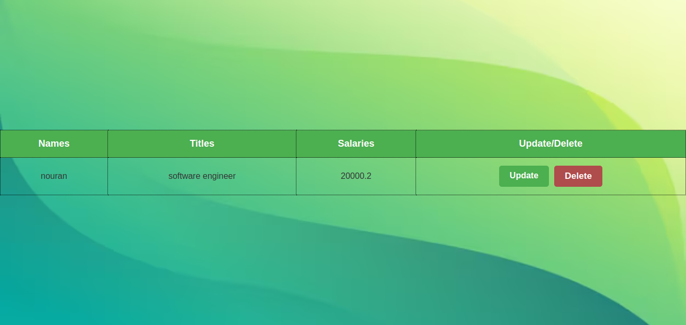

# Java_and_JavaSpring
this repo made for java revision and dive into java spring boot
# Staff Simple CRUD System - Backend (Demo Directory)






## 📄 Project Description

This backend application is built using Java Spring MVC, providing the server-side logic and database management for a **Staff Simple CRUD System**. It allows users to manage staff members, including functionality to create, read, update, and delete staff records.

## ✨ Features
- Add new staff functionality.
- View all staff with CRUD operations.
- Update and delete staff members.

## ⚙️ Installation Instructions

1. **Clone the Repository:**
    ```bash
    git clone git@github.com:NooranTarek/staff_crud_system.git
    ```
2. **Navigate to the Backend Directory:**
    ```bash
    cd demo
    ```
3. **Install Dependencies:**
    ```bash
    mvn clean install
    ```
4. **Run the Application:**
    ```bash
    ./mvn clean spring-boot:run
    ```
5. **Access the Application:**
    The application will be running at [http://localhost:8080](http://localhost:8080).

## 📄 Pages

- **Add New Staff Page:** Form to add a new staff member with name, title, and salary.
- **View All Staff Page:** Displays a table of all staff members with the option to update or delete them.

### Explanation of the Files and Methods

Here’s a breakdown of the key components in the backend:

1. **Controller Methods (StaffController)**:
   - **addNewStaff()**: Displays the form to add or update a staff member based on the `id` query parameter.
   - **dataSubmitForm()**: Handles both adding a new staff member or updating an existing one.
   - **deleteStaffMember()**: Deletes a staff member based on the `id` passed in the form.

2. **HTML Views**:
   - **addNewStaff.html**: A form for adding or updating staff information.
   - **getAllStaff.html**: Displays all staff in a table with options to update or delete each entry.
Made with ❤️ by [Nooran Tarek](https://github.com/NooranTarek)

---


